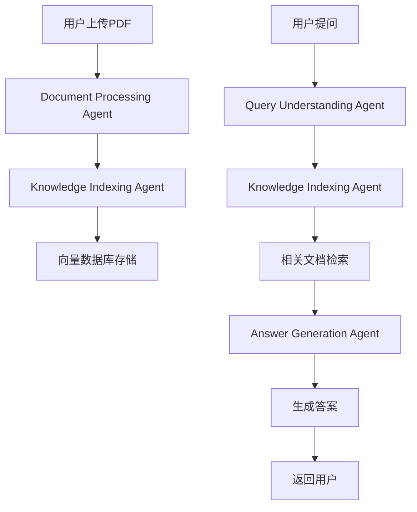

# 📚 PaperPal - AI论文助手

> **让AI帮你理解任何学术论文 | 字节跳动TRAE黑客松作品**

## 🎯 项目概述

PaperPal是一个基于AI agents架构的智能论文理解助手，通过多模态AI agents协作，实现PDF学术论文的深度理解与智能问答。项目采用RAG（检索增强生成）技术，结合火山引擎豆包API、OpenAI GPT和阿里云通义千问等大语言模型，为用户提供专业、准确的学术论文解读服务。

## 🏗️ AI Agents架构设计

### 🤖 核心AI Agents

#### 1. **Document Processing Agent (文档处理代理)**
- **职责**: PDF文档解析、文本提取、结构分析
- **技术栈**: PyPDF2, LangChain Document Loaders
- **能力**: 
  - 多格式PDF支持
  - 智能文本分割
  - 文档结构识别
  - 元数据提取

#### 2. **Knowledge Indexing Agent (知识索引代理)**
- **职责**: 向量化存储、语义索引、知识图谱构建
- **技术栈**: ChromaDB, OpenAI Embeddings
- **能力**:
  - 语义向量化
  - 智能分块策略
  - 上下文关联
  - 快速检索优化

#### 3. **Query Understanding Agent (查询理解代理)**
- **职责**: 用户意图识别、问题分类、查询优化
- **技术栈**: 多LLM集成, 自然语言处理
- **能力**:
  - 意图识别
  - 问题分类
  - 查询重写
  - 多轮对话管理

#### 4. **Answer Generation Agent (答案生成代理)**
- **职责**: 答案生成、上下文整合、质量保证
- **技术栈**: 火山引擎豆包API, OpenAI GPT, 阿里云通义千问
- **能力**:
  - 多模型协作
  - 上下文感知
  - 答案验证
  - 多语言支持

### 🔄 Agents协作流程



## 🛠️ 技术架构

### 核心技术栈
- **前端框架**: Streamlit (快速原型开发)
- **AI编排**: LangChain (智能工作流管理)
- **向量数据库**: ChromaDB (内存模式，高性能检索)
- **大语言模型**: 
  - 火山引擎豆包API (主要)
  - OpenAI GPT-3.5 (备选)
  - 阿里云通义千问 (备选)
- **文档处理**: PyPDF2 (PDF解析)
- **向量化**: OpenAI Embeddings (语义向量生成)

### 系统架构特点
- **模块化设计**: 各AI agents独立运行，易于扩展
- **多模型支持**: 支持多种LLM API，确保服务稳定性
- **实时处理**: 内存模式向量数据库，毫秒级响应
- **智能缓存**: Streamlit缓存机制，避免重复计算

## 🚀 功能特性

### 📖 智能论文理解
- **深度解析**: 自动识别论文结构、方法、结果
- **语义理解**: 基于向量相似度的智能检索
- **上下文感知**: 保持对话连贯性，理解用户意图

### 💬 自然语言交互
- **多轮对话**: 支持连续提问，上下文记忆
- **智能问答**: 基于论文内容的精准回答
- **多语言支持**: 中英文论文和对话

### 🔍 精准信息检索
- **语义搜索**: 超越关键词匹配的智能检索
- **相关度排序**: 基于向量相似度的结果排序
- **快速响应**: 毫秒级检索速度

## 📋 使用指南

### 环境配置
```bash
# 克隆项目
git clone [repository-url]
cd PaperPal

# 创建虚拟环境
python3 -m venv venv
source venv/bin/activate

# 安装依赖
pip install -r requirements.txt

# 配置环境变量
cp env_example.txt .env
# 编辑.env文件，填入API密钥
```

### 启动应用
```bash
streamlit run app.py --server.port 8501
```

### 使用流程
1. **上传PDF**: 选择要分析的学术论文
2. **等待处理**: AI agents自动解析和索引
3. **开始对话**: 输入关于论文的任何问题
4. **获得答案**: 基于论文内容的智能回答

## 🎯 应用场景

### 学术研究
- **论文综述**: 快速理解研究领域现状
- **方法分析**: 深入理解技术方法和创新点
- **结果解读**: 准确理解实验数据和结论

### 教学辅助
- **课程准备**: 教师快速备课和材料准备
- **学生辅导**: 帮助学生理解复杂论文内容
- **知识问答**: 针对性的学术问题解答

### 企业应用
- **技术调研**: 快速了解前沿技术发展
- **专利分析**: 理解相关技术专利内容
- **竞品研究**: 分析竞争对手技术方案

## 🔬 技术亮点

### 1. **多Agent协作架构**
- 每个Agent专注特定任务，提高系统可靠性
- 模块化设计，易于功能扩展和性能优化
- 支持Agent间的智能协作和信息传递

### 2. **智能RAG系统**
- 基于语义的文档分块策略
- 动态上下文窗口，平衡准确性和效率
- 多模型融合，提升答案质量

### 3. **实时性能优化**
- 内存模式向量数据库，毫秒级响应
- 智能缓存机制，避免重复计算
- 异步处理，支持并发用户访问

## 🚧 开发计划

### 短期目标 (1-2周)
- [ ] 支持更多文档格式 (Word, Markdown)
- [ ] 添加对话历史保存功能
- [ ] 优化移动端体验

### 中期目标 (1-2月)
- [ ] 多文档对比分析
- [ ] 知识图谱可视化
- [ ] 支持更多语言模型

### 长期目标 (3-6月)
- [ ] 多模态输入支持 (图片、音频)
- [ ] 个性化学习推荐
- [ ] 企业级部署方案

## 🤝 贡献指南

欢迎贡献代码、报告问题或提出建议！

### 贡献方式
1. Fork项目
2. 创建功能分支
3. 提交代码
4. 创建Pull Request


**PaperPal** - 让AI成为你的学术研究助手 🚀
